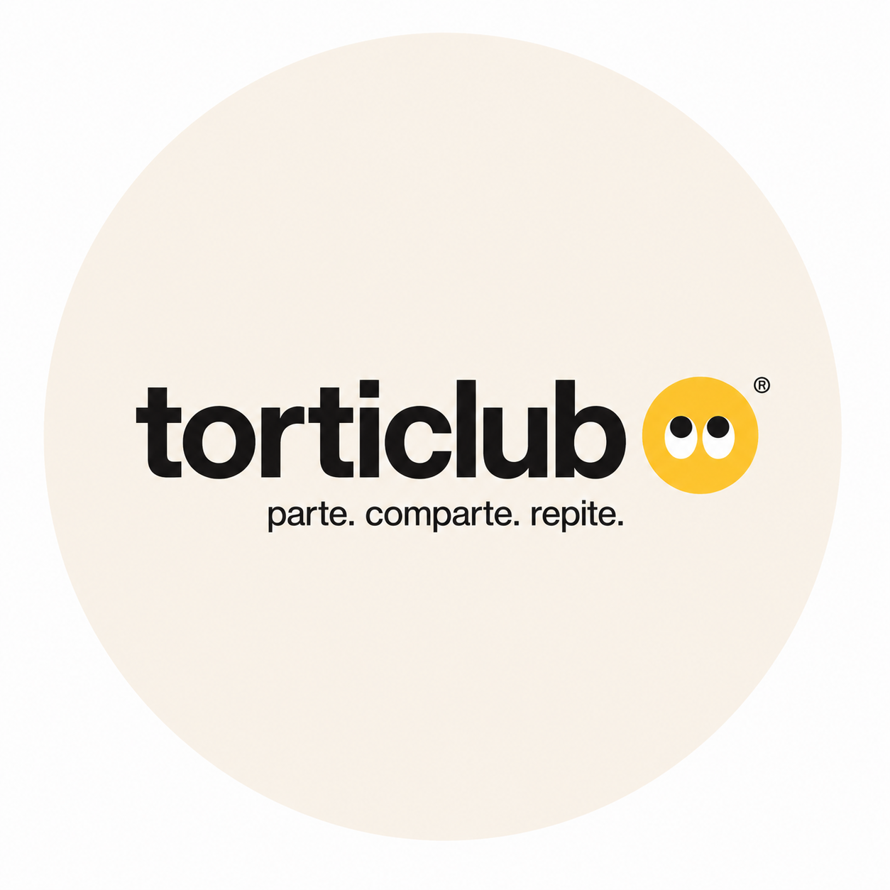
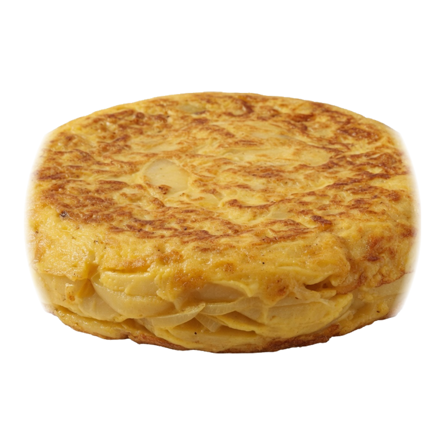
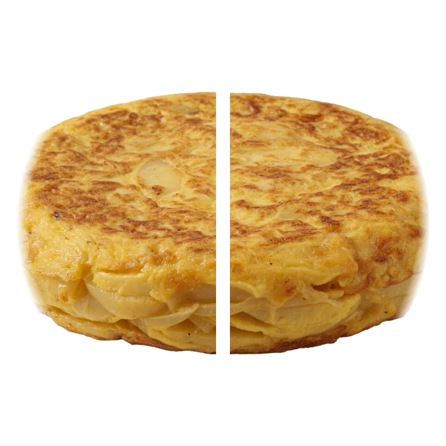
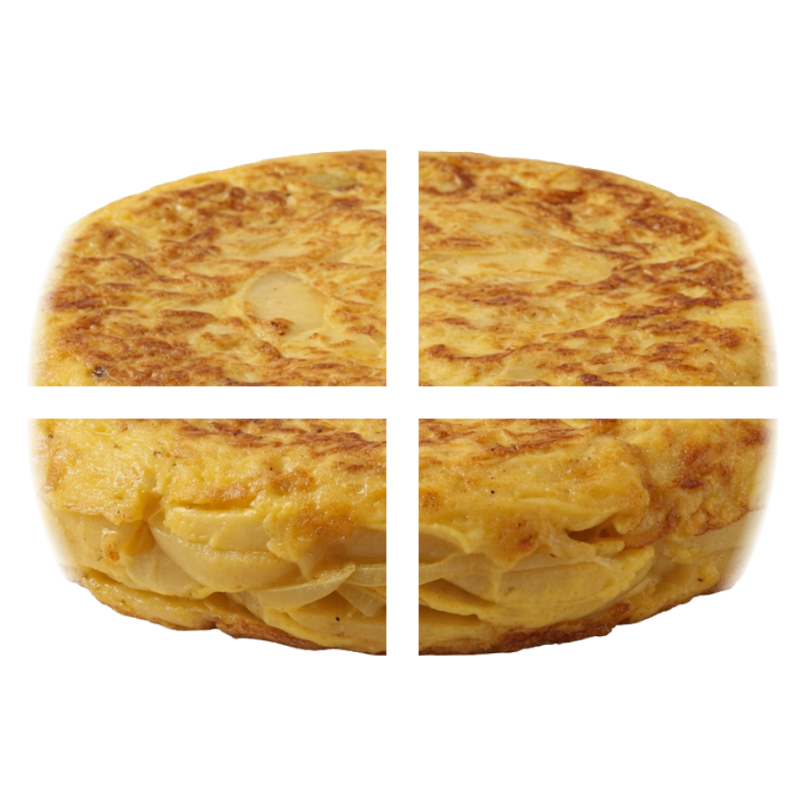

<!--
  ╔══════════════════════════════════════════════════════════════╗
  ║  TORTICLUB · PROPRIETARY · ALL RIGHTS RESERVED               ║
  ║  Hecho por Cristian Querol / thedevroom                      ║
  ║  https://github.com/thedevroom/torticlub                     ║
  ╚══════════════════════════════════════════════════════════════╝
-->

<p align="center">
  
</p>

<h1 align="center">
  
</h1>

<p align="center">
  <b>Parte. Comparte. Repite.</b><br/>
  <sub>Product-first food brand · Tortillas para compartir · Solo Barcelona</sub>
</p>

<p align="center">
  <a href="https://torticlubworld.vercel.app">
    
  </a>
  <a href="https://github.com/thedevroom/torticlub/releases/tag/v1.1.0">
    
  </a>
</p>

<p align="center">
  <a href="https://github.com/thedevroom/torticlub/stargazers"></a>
  <a href="https://github.com/thedevroom/torticlub/network/members"></a>
  
  
  
  
  
  
  
</p>

<p align="center">
  <a href="https://torticlubworld.vercel.app"><b>Demo</b></a> ·
  <a href="https://torticlubworld.vercel.app/pedir">Pedir</a> ·
  <a href="https://torticlubworld.vercel.app/carta">Carta</a> ·
  <a href="#monorepo-map">Map</a> ·
  <a href="#quick-start">Install</a> ·
  <a href="./PROTECTION.md">Protection</a> ·
  <a href="https://github.com/thedevroom"><b>thedevroom</b></a>
</p>

---

<details open>
<summary><b>⚠️ LEGAL — READ FIRST</b></summary>

<br/>

> ### TODO ABSOLUTAMENTE ESTÁ PROTEGIDO  
> ### EVERYTHING IN THIS REPOSITORY IS PROTECTED  

This is **not** open-source software for commercial reuse.  
Brand, code, product frames, packaging and docs are **proprietary**.

| | |
|:--|:--|
| Full terms | [`LICENSE`](./LICENSE) |
| Short notice | [`PROTECTION.md`](./PROTECTION.md) |
| Author | **Cristian Querol** · [`@thedevroom`](https://github.com/thedevroom) |

</details>

---

## What is TortiClub?

A **complete food-brand project** — not only a website.

<table>
<tr>
<td width="50%">

### Brand
Eyes symbol · cream / yellow / ink  
Mantra-led product language  
Packaging & print system  

### Product
**SOLO** · **DUO** · **CLUB**  
Share ritual as UX  
60-frame scroll sequence  

</td>
<td width="50%">

### Technology
Next.js 16 · React 19 · TS  
Motion + GSAP scrub  
Admin ops panel  

### City
**Barcelona only**  
Local SEO + schema.org  
D2C web checkout  

</td>
</tr>
</table>

```text
                    ┌──────────────────┐
                    │   TORTICLUB      │
                    │  Parte.Comparte. │
                    │     Repite.      │
                    └────────┬─────────┘
           ┌─────────────────┼─────────────────┐
           ▼                 ▼                 ▼
      ┌─────────┐      ┌─────────┐      ┌─────────┐
      │  SOLO   │      │   DUO   │      │  CLUB   │
      │  whole  │  →   │ 2 halves│  →   │4 quarters│
      └─────────┘      └─────────┘      └─────────┘
           geometric frame sequence · 60 PNG · transparent
```

---

## Showcase

<p align="center">
  
  
  
</p>

<p align="center">
  
</p>

<p align="center">
  <sub>SOLO → DUO → CLUB · packaging · brand system</sub>
</p>

---

## Monorepo map

```text
torticlub/
├── branding/                 # Marketing & identity (no Instagram drafts)
│   ├── logo/                 # icon.png · logo-oficial · wordmark
│   ├── packaging/            # boxes, stickers, thank-you cards
│   ├── print/                # poster, carta, prototype
│   └── product/              # SOLO · DUO · CLUB plates
├── docs/                     # Brand system + business dossier
├── web/                      # Next.js production application
│   ├── public/brand/         # Runtime assets + 60-frame sequence
│   ├── src/app/              # Routes, SEO, server actions
│   ├── src/components/       # UI, brand, home, admin
│   └── scripts/              # Frame generator
├── LICENSE                   # Proprietary — all rights reserved
├── PROTECTION.md             # Protection summary
├── CHANGELOG.md
└── README.md                 # You are here
```

> Instagram highlight drafts and private social notes are **excluded** from this repository on purpose.

---

## Features

| Area | Capability |
|:-----|:-----------|
| 🛒 Storefront | Hero, product stage, formats, flavours, FAQ |
| ✋ Order UX | Configurator + **hold-to-confirm** |
| 📅 Reservations | Next-day capacity booking |
| 🛠️ Admin | Orders, stock, messages, campaigns (`/admin`) |
| 🎞️ Ritual | 60-frame SOLO→DUO→CLUB scroll (exact 1 / 2 / 4 pieces) |
| 🔍 SEO | Barcelona keywords, sitemap, JSON-LD FoodEstablishment |
| 🎨 Brand kit | Logo PNG transparent, packaging, print masters |
| 🔐 Security | Env-only credentials · JWT httpOnly sessions |

---

## Stack & packages

| Layer | Choice |
|:------|:-------|
| Framework | [Next.js 16](https://nextjs.org) App Router |
| Language | TypeScript 5 |
| UI | React 19 · Tailwind CSS v4 · Motion · GSAP |
| State | Zustand |
| Auth | `jose` (HS256) |
| Images | `sharp` (frame pipeline) |
| Deploy | Vercel → [torticlubworld.vercel.app](https://torticlubworld.vercel.app) |

**Runtime packages**

```
next · react · react-dom · motion · gsap · @gsap/react
lenis · zustand · jose · zod · clsx · tailwind-merge · lucide-react
```

Pinned versions live in [`web/package.json`](./web/package.json).

---

## Quick start

```bash
# Clone monorepo
git clone https://github.com/thedevroom/torticlub.git
cd torticlub/web

# Install
npm install

# Environment
cp .env.example .env.local
# set ADMIN_USERNAME, ADMIN_PASSWORD, AUTH_SECRET

# Develop
npm run dev
```

| URL | Purpose |
|:----|:--------|
| http://localhost:3000 | Storefront |
| http://localhost:3000/pedir | Order flow |
| http://localhost:3000/admin | Ops panel |

### Regenerate ritual frames

```bash
cd web
node scripts/generate-frames.mjs
```

---

## Environment

```env
ADMIN_USERNAME=
ADMIN_PASSWORD=
AUTH_SECRET=
NEXT_PUBLIC_WHATSAPP_URL=   # optional deep-link only
```

```bash
node -e "console.log(require('crypto').randomBytes(32).toString('hex'))"
```

Never commit secrets. See [`web/.env.example`](./web/.env.example).

---

## Brand system

| Token | Hex | Role |
|:------|:----|:-----|
| Surface | `#F7F3E8` | Background |
| Primary | `#FFD23F` | Accent / eyes |
| Ink | `#111111` | Type & UI |

```text
Mantra   Parte. Comparte. Repite.
City     Barcelona (exclusive service area)
Icon     branding/logo/icon.png  (PNG, transparent)
```

More: [`docs/BRAND_SYSTEM.md`](./docs/BRAND_SYSTEM.md)

---

## SEO & discovery

Optimized for product + local discovery:

`#TortiClub` `#Barcelona` `#Tortilla` `#FoodBrand` `#D2C` `#Nextjs` `#TypeScript` `#ProductDesign` `#FoodDeliveryBarcelona` `#ShareFood` `#SpanishFood` `#thedevroom` `#AwwwardsStyle` `#BrandSystem`

**GitHub topics:** `nextjs` · `typescript` · `tailwindcss` · `react` · `vercel` · `food` · `barcelona` · `ecommerce` · `branding` · `d2c` · `product-design`

---

## Links

| Resource | URL |
|:---------|:----|
| **Live** | https://torticlubworld.vercel.app |
| **Repository** | https://github.com/thedevroom/torticlub |
| **Releases** | https://github.com/thedevroom/torticlub/releases |
| **Author** | https://github.com/thedevroom |
| **Instagram** (public handle only) | [@torticlub](https://instagram.com/torticlub) |

---

## Changelog

See [`CHANGELOG.md`](./CHANGELOG.md).

---

## Credits

<table>
<tr>
<td>

**Hecho por**  
**Cristian Querol**

</td>
<td>

**GitHub**  
[**thedevroom** ↗](https://github.com/thedevroom)

</td>
<td>

**© TortiClub**  
All rights reserved

</td>
</tr>
</table>

<p align="center">
  <br/><br/>
  <code>parte. comparte. repite.</code><br/>
  <sub>Barcelona · Proprietary project</sub>
</p>

<p align="center">
  <a href="https://github.com/thedevroom/torticlub">★★★ Star this repository</a>
  if the craft deserves it.
</p>
