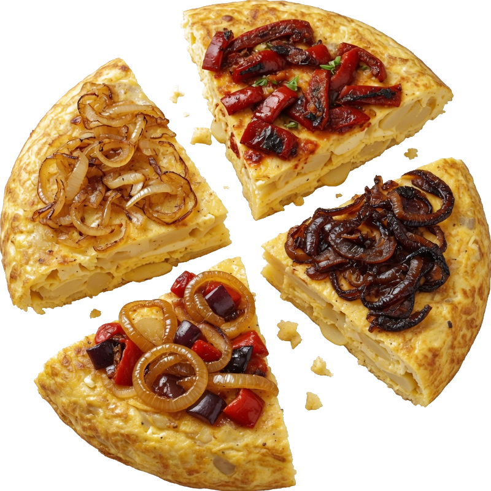
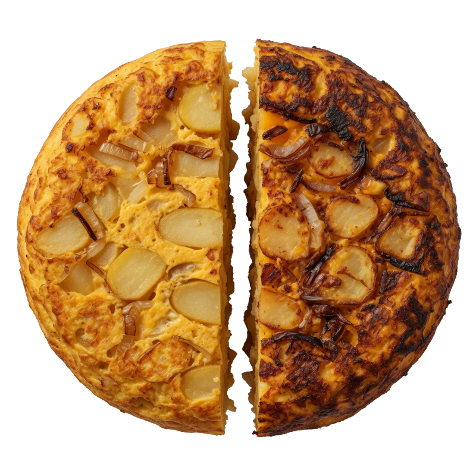
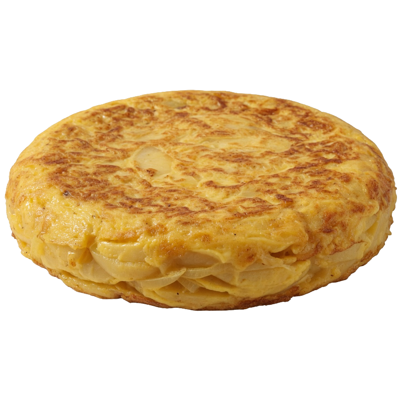
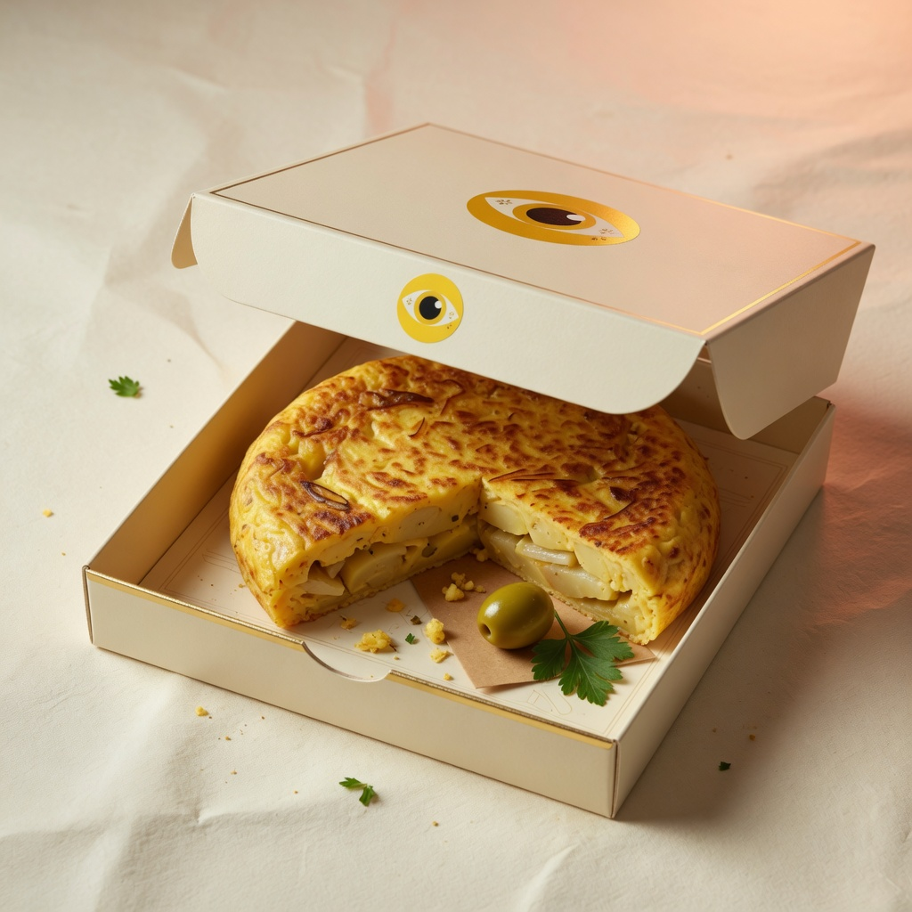

<!--
  TortiClub · by Cristian Querol / thedevroom
  Live: https://torticlubworld.vercel.app
-->

<p align="center">
  
</p>

<h1 align="center">TortiClub</h1>

<p align="center">
  <strong>Parte. Comparte. Repite.</strong><br />
  Product-first food brand · Tortillas para compartir · <b>Solo Barcelona</b>
</p>

<p align="center">
  <a href="https://torticlubworld.vercel.app"></a>
  &nbsp;
  <a href="https://github.com/thedevroom/torticlub/releases/latest"></a>
</p>

<p align="center">
  <a href="https://github.com/thedevroom/torticlub/stargazers"></a>
  <a href="https://github.com/thedevroom/torticlub/network/members"></a>
  
  
  
  
  
  
</p>

<p align="center">
  <a href="https://torticlubworld.vercel.app">Demo</a> ·
  <a href="https://torticlubworld.vercel.app/pedir">Pedir</a> ·
  <a href="https://torticlubworld.vercel.app/carta">Carta</a> ·
  <a href="#quick-start">Install</a> ·
  <a href="#features">Features</a> ·
  <a href="https://github.com/thedevroom">thedevroom</a>
</p>

---

<p align="center">
  
  &nbsp;&nbsp;
  
  &nbsp;&nbsp;
  
</p>

<p align="center">
  
</p>

---

## Why TortiClub

A **direct-to-consumer food brand** site — not a generic restaurant template.

| | |
|:--|:--|
| **Brand** | Eyes logo, cream / yellow / ink system, mantra-led UX |
| **Product** | SOLO · DUO · CLUB — share-first formats |
| **City** | SEO and service area locked to **Barcelona** |
| **Flow** | Configurator → hold-to-confirm → admin ops |
| **Craft** | Motion, frame sequences, product photography as UI |

```
  ┌─────────┐   ┌─────────┐   ┌─────────┐
  │  SOLO   │   │   DUO   │   │  CLUB   │
  │ 9,90 €+ │   │ 12,90 € │   │ 14,90 € │
  └────┬────┘   └────┬────┘   └────┬────┘
       └─────────────┼─────────────┘
                     ▼
              Pedido online
           confirmación en app
```

---

## Features

- **Storefront** — Hero, product stage, formats, flavours, FAQ
- **Order UX** — Multi-step configurator with hold-to-confirm
- **Ops panel** — `/admin` orders, stock, reservations, messages
- **Brand kit** — Logo, packaging, stickers, product frames in `/public/brand`
- **Motion** — Scroll storytelling + frame sequence of the share ritual
- **SEO local** — Schema.org `FoodEstablishment`, sitemap, Barcelona keywords
- **Secure admin** — JWT httpOnly cookie, env-only credentials

---

## Stack

| Layer | Package / tool |
|:------|:---------------|
| Framework | [Next.js 16](https://nextjs.org) App Router |
| UI | React 19 · Tailwind CSS v4 · Motion |
| State | Zustand |
| Auth | `jose` (HS256 JWT) |
| Validation | Zod |
| Deploy | [Vercel](https://vercel.com) → [torticlubworld.vercel.app](https://torticlubworld.vercel.app) |

### Packages (runtime)

```
next · react · react-dom · motion · lenis · gsap
zustand · jose · zod · clsx · tailwind-merge · lucide-react
```

See [`package.json`](./package.json) for pinned versions.

---

## Quick start

```bash
git clone https://github.com/thedevroom/torticlub.git
cd torticlub
npm install
cp .env.example .env.local
npm run dev
```

| URL | Purpose |
|:----|:--------|
| http://localhost:3000 | Storefront |
| http://localhost:3000/pedir | Order flow |
| http://localhost:3000/admin | Ops panel |

---

## Environment

```env
ADMIN_USERNAME=
ADMIN_PASSWORD=
AUTH_SECRET=
NEXT_PUBLIC_WHATSAPP_URL=   # optional
```

```bash
node -e "console.log(require('crypto').randomBytes(32).toString('hex'))"
```

Never commit `.env.local`.

---

## Scripts

```bash
npm run dev      # development
npm run build    # production build
npm run start    # serve build
npm run lint     # ESLint
```

---

## Project map

```
torticlub/
├── public/brand/          # identity + product assets
├── src/app/               # routes, SEO, server actions
│   ├── admin/             # protected dashboard
│   ├── pedir/ · reservar/
│   └── actions/
├── src/components/
│   ├── brand/ · home/ · layout/ · pages/ · ui/
├── src/lib/               # auth, catalog tokens, store
└── src/middleware.ts      # /admin guard
```

---

## Brand system

| Token | Hex | Use |
|:------|:----|:----|
| Surface | `#F7F3E8` | Background |
| Primary | `#FFD23F` | Accent / eyes |
| Ink | `#111111` | Type & UI |

**Mantra:** Parte. Comparte. Repite.  
**City:** Barcelona only.

---

## SEO & discovery

Optimized for search and social:

`#TortiClub` `#Barcelona` `#Tortilla` `#FoodBrand` `#D2C` `#Nextjs` `#TypeScript` `#AwwwardsStyle` `#FoodDeliveryBarcelona` `#ShareFood` `#SpanishFood` `#ProductDesign` `#thedevroom`

Topics on this repo:  
`nextjs` · `typescript` · `tailwindcss` · `food` · `barcelona` · `ecommerce` · `branding` · `react` · `vercel` · `d2c`

---

## Links

| | |
|:--|:--|
| **Live** | https://torticlubworld.vercel.app |
| **Repo** | https://github.com/thedevroom/torticlub |
| **Release** | https://github.com/thedevroom/torticlub/releases |
| **Author** | [Cristian Querol](https://github.com/thedevroom) · **thedevroom** |
| **Instagram** | [@torticlub](https://instagram.com/torticlub) |

---

## Security

- Secrets only via environment variables  
- Admin session: httpOnly + `sameSite=strict`  
- Public UI never embeds private phone numbers  

---

## License

**Proprietary** — © TortiClub. All rights reserved.  
Code and brand assets may not be redistributed without permission.

---

<p align="center">
  <br /><br />
  <b>Hecho por Cristian Querol / <a href="https://github.com/thedevroom">thedevroom</a></b><br />
  <sub>parte. comparte. repite. · Barcelona</sub>
</p>

<p align="center">
  <a href="https://github.com/thedevroom/torticlub">★ Star this project</a>
  if the craft inspires you.
</p>
